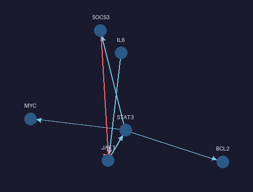

# BioPulse

**BioPulse** is a Python package for the dynamic visualization of Boolean and biological networks.
Render pre-computed simulations as interactive Jupyter widgets or export them as standalone HTML, GIF, and MP4.



---

## Features

- **Interactive Jupyter widget** — PixiJS-powered canvas with zoom/pan, node tooltips, click-to-highlight upstream/downstream paths
- **60 fps animation** — event-driven playback with colour-fade and scale-pulse on node activation
- **Advanced effects** — soft glow halos, expanding pulse rings, cumulative heatmap colouring, edge particles
- **Standalone HTML export** — one self-contained file, opens in any browser, no Python required
- **GIF & MP4 export** — raster animation with the same visual style as the Jupyter widget
- **Biological parsers** — import from SIF, GINML (GINsim), SBML Level 3 + qual
- **JSON round-trip** — canonical format readable/writable by `load_graph`, `load_scene`, `export_graph`, `export_scene`

---

## Installation

```bash
pip install biopulse                  # core (Jupyter widget + parsers + JSON I/O)
pip install 'biopulse[export]'        # + GIF/MP4 export (Pillow + imageio/ffmpeg)
```

Development setup:

```bash
git clone https://github.com/Nurtal/BioPulse
cd BioPulse
pip install -e '.[dev,export]'
```

---

## Quick start

### Static graph in Jupyter

```python
import biopulse
from biopulse.model.graph import Graph
from biopulse.model.schema import Graph as GraphSchema

nodes = [
    {"id": "IL6",   "group": "cytokine"},
    {"id": "JAK1",  "group": "kinase"},
    {"id": "STAT3", "group": "transcription_factor"},
    {"id": "SOCS3", "group": "feedback"},
]
edges = [
    {"source": "IL6",   "target": "JAK1",  "type": "activation"},
    {"source": "JAK1",  "target": "STAT3", "type": "activation"},
    {"source": "STAT3", "target": "SOCS3", "type": "activation"},
    {"source": "SOCS3", "target": "JAK1",  "type": "inhibition"},
]
graph = Graph(GraphSchema.model_validate({"nodes": nodes, "edges": edges}))

# Returns a GraphWidget that displays automatically in Jupyter
biopulse.show(graph)
```

**Interactions:** scroll to zoom, drag to pan, hover a node for its tooltip, click a node to highlight its upstream/downstream path (click again to clear). Set `widget.highlighted_nodes = ["STAT3"]` from Python to highlight programmatically.

### Animated playback in Jupyter

```python
from biopulse.model.events import EventStream
from biopulse.model.schema import Event

events = EventStream([
    Event(t=0.0, node="IL6",   state=1),
    Event(t=0.4, node="JAK1",  state=1),
    Event(t=0.9, node="STAT3", state=1),
    Event(t=1.3, node="SOCS3", state=1),
    Event(t=1.8, node="JAK1",  state=0),
])

widget = biopulse.play(graph, events, speed=1.0, autoplay=True)
widget  # displays in Jupyter
```

The **control bar** provides restart, play/pause, speed buttons (0.5×/1×/2×/4×), a scrubber, and a live time display. Python can also seek and control playback:

```python
widget.playback_state = "paused"
widget.current_t = 1.0          # seek to t=1.0 s
widget.playback_speed = 2.0
```

#### Phase 7 visual effects

All effects are togglable via traitlets:

```python
widget.glow_enabled        = True   # soft bloom halo around active nodes (default: True)
widget.pulse_ring_enabled  = True   # expanding ring on activation          (default: True)
widget.heatmap_enabled     = False  # amber colour ∝ cumulative activations (default: False)
widget.particles_enabled   = False  # particles along activation edges       (default: False)
```

---

## Loading biological formats

### SIF (Simple Interaction Format)

```python
graph = biopulse.parse_sif("network.sif")

# Or from a string buffer
import io
sif = """
IL6   1   JAK1
JAK1  1   STAT3
SOCS3 -1  JAK1
"""
graph = biopulse.parse_sif(io.StringIO(sif))
```

Supported interaction type tokens (case-insensitive): `1 / a / + / activates / activation / ->` for activation; `-1 / i / - / inhibits / inhibition / -|` for inhibition. Unknown tokens are accepted when `default_type="activation"` is passed.

### GINML (GINsim)

```python
graph = biopulse.parse_ginml("model.ginml")
# node nodeclass → group; edge sign="positive/negative" → activation/inhibition
```

### SBML Level 3 + qual

```python
graph = biopulse.parse_sbml("model.sbml")
# qualitativeSpecies → nodes (compartment → group)
# transition inputs → edges (sign="positive/negative")
# No python-libsbml dependency — uses stdlib xml.etree.ElementTree
```

### Canonical JSON

```python
# Load
graph  = biopulse.io.json_loader.load_graph("network.graph.json")
events = biopulse.io.json_loader.load_events("timeline.events.json")
graph, events = biopulse.io.json_loader.load_scene("simulation.scene.json")

# Save (round-trippable)
biopulse.export_graph(graph, "network.graph.json")
biopulse.export_events(events, "timeline.events.json")
biopulse.export_scene(graph, events, "simulation.scene.json")
```

---

## Exporting

### Standalone HTML

```python
# Static (zoom/pan/tooltip/highlight — no events needed)
biopulse.export_html(graph, "network.html")

# Animated (full control bar + all Phase 7 effects)
biopulse.export_html(graph, "cascade.html", events=events,
                     title="IL-6/STAT3 Cascade", speed=1.0)
```

Open the resulting `.html` file in any browser — no Python, no Jupyter, no local server required. PixiJS is loaded from CDN on first open.

### GIF

```python
biopulse.export_gif(
    graph, events, "cascade.gif",
    width=500, height=380,
    fps=20,
    speed=0.8,   # slow down for clarity
)
```

### MP4

```python
biopulse.export_mp4(
    graph, events, "cascade.mp4",
    width=800, height=600,
    fps=30,
)
```

Requires ffmpeg (installed via `pip install 'biopulse[export]'` which pulls in `imageio[ffmpeg]`).

---

## Custom layouts

The default layout is `ForceAtlasLayout` (NetworkX `spring_layout`). Implement the `Layout` protocol to supply your own:

```python
from biopulse.layouts.base import Layout
from biopulse.model.graph import Graph

class CircularLayout(Layout):
    def compute(self, graph: Graph) -> dict[str, tuple[float, float]]:
        import math
        ids = graph.node_ids
        n = len(ids)
        return {nid: (math.cos(2*math.pi*i/n), math.sin(2*math.pi*i/n))
                for i, nid in enumerate(ids)}

biopulse.show(graph, layout=CircularLayout())
```

---

## Architecture

```
biopulse/
├── model/
│   ├── schema.py       # Pydantic v2 canonical models (Node, Edge, Graph, Event, …)
│   ├── graph.py        # Graph wrapper around networkx.DiGraph
│   └── events.py       # EventStream — sorted, bisect-based seek
├── io/
│   ├── json_loader.py  # load_graph / load_events / load_scene
│   └── exporters.py    # export_graph/events/scene/html/gif/mp4
├── parsers/
│   ├── sif.py          # SIF format
│   ├── ginml.py        # GINML / GINsim
│   └── sbml.py         # SBML Level 3 + qual
├── layouts/
│   ├── base.py         # Layout protocol
│   └── forceatlas.py   # Spring-layout wrapper
└── core/
    ├── renderer/
    │   ├── widget.py          # GraphWidget + PlayWidget (anywidget)
    │   ├── _pixi_graph.js     # Static renderer (PixiJS v7)
    │   ├── _pixi_play.js      # Animated renderer with Phase 7 effects
    │   └── _raster.py         # Pillow frame renderer for GIF/MP4
    ├── animation/
    │   ├── interp.py          # ease_in_out, lerp_color, ring_*, heatmap_color
    │   └── state.py           # AnimationState / NodeVisualState
    └── timeline/
        ├── clock.py           # Clock state machine
        └── scheduler.py       # Event windowing for ticker loop
```

**Core principles:**
- **Renderer-first** — BioPulse visualises pre-computed dynamics; it does not simulate Boolean trajectories.
- **Canonical JSON is the only data contract** — all parsers produce the same `{nodes, edges}` / `{events}` schema; the renderer only reads that form.
- **Event-driven, not snapshot-driven** — state over time is `{t, node, state}` events; interpolation is the renderer's job.

---

## Development

```bash
pytest                         # run all 275 tests
ruff check . && ruff format .  # lint + format
mypy biopulse                  # type-check
```

Run a single test file:

```bash
pytest tests/test_parsers.py -v
```

---

## Roadmap

| Phase | Status | Description |
|-------|--------|-------------|
| 0 — Scaffolding | ✅ | `pyproject.toml`, CI, ruff/mypy/pytest |
| 1 — Data model | ✅ | Pydantic v2 schemas, EventStream, Graph, JSON loaders |
| 2 — Static renderer | ✅ | `biopulse.show()`, ForceAtlasLayout, PixiJS widget |
| 3 — Animation (MVP) | ✅ | `biopulse.play()`, 60 fps ticker, colour fade, pulse |
| 4 — Interactions | ✅ | Zoom/pan, tooltip, path highlight, scrubber, controls |
| 5 — Parsers | ✅ | SIF, GINML, SBML-qual |
| 6 — Export | ✅ | JSON round-trip, standalone HTML, GIF, MP4 |
| 7 — Visual effects | ✅ | Glow, pulse rings, heatmap, edge particles |
| 8 — Ecosystem | 🔜 | PyBoolNet interop, Cytoscape, Sphinx docs, PyPI v0.1 |

---

## License

MIT — see `LICENSE`.
